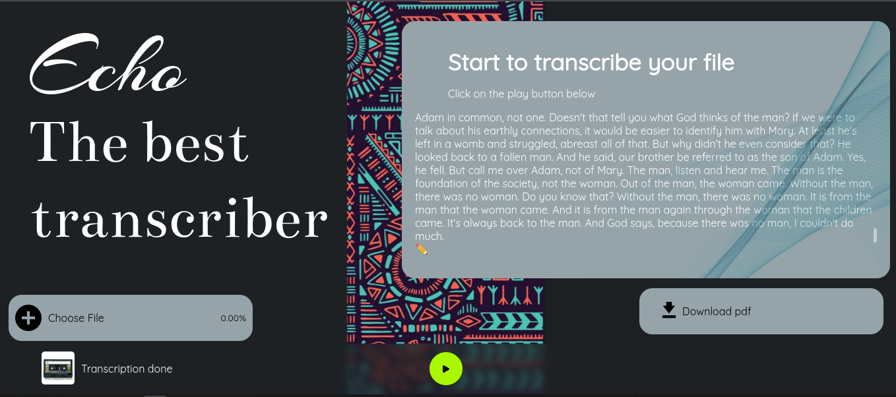

# Echo

Author: Stephen Karanja. 31/08/2023.

Description: A simple transcription application that allows one to upload audio or video files and transcribe them and download the transcribed file.

Landing Page:

Demo: You can demo the site here.

Features:
- upload your audio or video file.
- After the upload is complete click on the play button to start transcription.
- Download the transcription text file.
Specifications:

Setup/Installation Requirements:
Here is a run-through of how to set up the application:

1. Clone this repository using the git clone link: https://github.com/SKaranjaN/Echo
2. Navigate to the directory: `cd server`, then `pipenv install && pipenv shell` or use your preferred environment, then `flask run` while in the server directory to initiate the server.
3. Open the client directory in another terminal created with your favorite IDE. If Atom, type `atom .`; if VSCode, type `code .`. This will launch the editor with the project setup. Now feel free to hack around the project.
4. For the API to fetch data you'll have to install json-server by running the bellow commands;
    `npm start`  
5. After this launch the application and have fun.
Known Bugs: None currently.

Technologies Used: REACT, HTML, CSS, JavaScript, Python Flask, Postgresql.

Support and Contact Details:
Primary E-mail Address: skaranja654@gmail.com

License: This project is licensed under the MIT License. (c) 2023 Stephen Karanja.